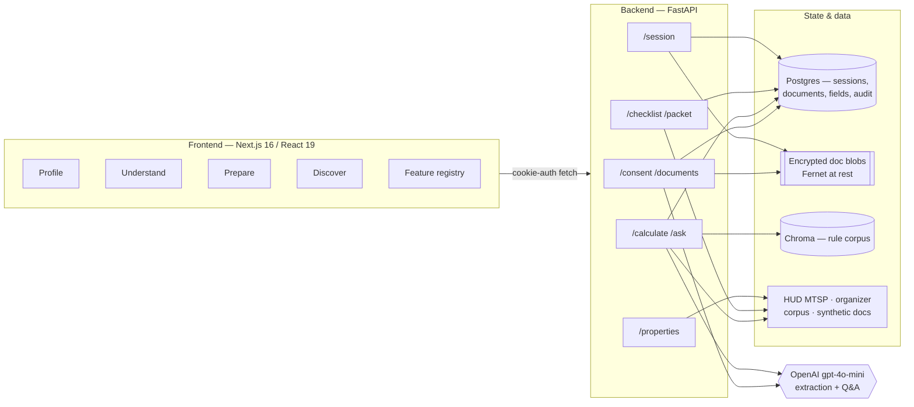

# RealDoor — Architecture & Risk Note

RealDoor is a renter-side application-readiness copilot. It turns synthetic household
documents into a human-confirmed profile, explains one program's rules with citations,
computes deterministic income-vs-limit math, and prepares a renter-controlled packet —
**without ever deciding eligibility**. The AI extracts, explains, retrieves, calculates,
and prepares; the renter confirms; a qualified human decides.

- **Program frozen:** LIHTC, using HUD **MTSP FY2026** income limits (metro:
  Boston-Cambridge), effective date preserved end to end.
- **Data:** synthetic documents only (6 households, organizer gold set).

---

## 1. System overview

**Stack**

| Layer | Choice |
|---|---|
| Frontend | Next.js 16 (App Router), React 19, Tailwind v4; pages `profile / understand / prepare / discover / feature-registry` |
| API | FastAPI, routers: `consent, documents, rules, packet, properties, session` |
| Persistence | SQLAlchemy → Postgres (prod) / SQLite (local); encrypted document blobs on disk |
| Retrieval | Chroma persistent vector store (rule corpus) |
| Model | OpenAI `gpt-4o-mini` — text + vision extraction, grounded Q&A |
| Deploy | Frontend → Vercel · Backend + Postgres → Render (free tier) |

---

## 2. The three-stage journey

### Stage 1 — Profile (human-confirmed extraction)
- Consent is required before any upload (`consent` gate on `/documents`).
- Text-layer PDFs are read with pypdf/pdfplumber; scanned PDFs and direct images fall
  back to **vision** extraction. Both paths use a **JSON-schema-constrained** call so the
  model can only return known fields.
- The model classifies the document into one of **5 types**; the server then **filters
  fields to that type's allowlist** — the model is never trusted to self-police which
  fields belong (`extraction.DOCUMENT_TYPES`).
- **Source boxes:** after extraction, `locate_bbox()` finds each value's real
  bounding box on the page (PDF points). The UI overlays it on a page render as visible
  evidence. Corrections re-locate the box; if a corrected value isn't on the document the
  box is cleared and the packet flips to `NEEDS_REVIEW` — evidence never lies.
- Every value is renter-correctable; confirmation is required before reuse.

### Stage 2 — Understand (cited rules + deterministic math)
- **Math is plain Python, never the LLM** (`calculator.py`): `annualize()` applies the
  confirmed pay frequency; the MTSP limit for the household size / AMI tier comes from the
  frozen corpus. Output carries value, threshold, formula, source, and **effective date**.
- **Q&A is RAG** (`rules_rag.py` + `/ask`): retrieves from the organizer rule corpus
  (incl. the safety / decision-boundary rules) and answers only from retrieved passages
  and the renter's own confirmed data. Citations are filtered to rule IDs that were both
  retrieved **and** used — no fabricated sources. It **abstains** when unsure and never
  labels the renter eligible.
- A **readiness signal** (`readiness.py`) reports `READY_TO_REVIEW` / `NEEDS_REVIEW`
  with plain-language reason codes — completeness/consistency only, explicitly *not* an
  eligibility decision.

### Stage 3 — Prepare (renter-controlled packet)
- Checklist marks each required document type present / missing / expired.
- Packet PDF (`packet_pdf.py`) summarizes confirmed profile, income comparison, and
  checklist, styled to the app identity, with an "assistive, not adjudicative" footer.
- Renter can preview, download, and delete. **Nothing is auto-sent** anywhere.

### Stretch — Discover (transparent property lookup)
- Read-only LIHTC property list for the metro, with SAFMR/FMR **market context only**.
- Renter-selected filters (town, min units) only; **no ranking, no acceptance
  prediction, no protected-trait proxies**. Availability is not implied — HUD's LIHTC set
  is locations, not vacancies.

---

## 3. Responsible-AI enforcement (where each control actually lives)

| Non-negotiable | Enforcement point |
|---|---|
| **No decisioning** | No eligibility/score/rank field exists in any schema; math is deterministic; `/ask` system prompt refuses decisions and defers to the housing authority |
| **No hidden proxies** | Field allowlist per document type; every field + purpose published on `/feature-registry` and `docs/feature-registry.md` |
| **Untrusted input** | Document text framed as untrusted data in the extraction prompt; server-side field filtering; injection strings can't add fields or change behavior |
| **Consent & correction** | Consent gate before upload; every field correctable; audit log records actions + rule versions, **never raw document contents** |
| **Privacy & security** | Synthetic docs only; Fernet encryption at rest; CORS locked to the frontend origin; `httponly` session cookie; renter-initiated session deletion |
| **Grounded citations** | Citations restricted to passages actually retrieved and used; abstain otherwise |

---

## 4. Data & privacy model

- **Session:** an `httponly` cookie ties a renter's data together; persistent for
  `SESSION_TTL_DAYS` (default 30) so they can return in the same browser to add a
  document, then auto-expires. **Device-bound by design** — no cross-device resume, no
  emailed links, no stored email (see `DATA_USE_AND_SAFETY.md`).
- **At rest:** document bytes are Fernet-encrypted; DB holds extracted/confirmed field
  values and an audit trail of actions + rule versions only.
- **Deletion:** `DELETE /session` removes documents, fields, consent, audit rows, and the
  cookie. Individual documents are separately deletable.
- **No training on uploads.** Model calls run with `store=False`.

---

## 5. Risks & mitigations

| Risk | Likelihood | Mitigation | Residual |
|---|---|---|---|
| Model invents an eligibility verdict | Med | No decision field; deterministic math; refusal prompt; abstention | Low |
| Prompt injection inside a document | Med | Untrusted-data framing + server-side field allowlist (model can't add fields) | Low |
| Extracted value wrong / mis-located box | Med | Renter confirms every field; corrections re-locate or clear the box → `NEEDS_REVIEW` | Low–Med |
| Fabricated / mismatched citation | Med | Citations filtered to retrieved-and-used rule IDs; abstain when unsure | Low |
| Sensitive data exposure | Low | Encryption at rest, cookie-scoped access, CORS lock, synthetic-only, deletion | Low |
| Stale rule data (wrong year) | Low | Frozen MTSP FY2026 corpus with preserved effective date; corpus re-ingested at startup | Low |
| Discover implies availability / ranks properties | Med | Filters-only, unranked, market-context labels, "locations not vacancies" copy | Low |
| Model/API outage | Med | Extraction/Q&A degrade with controlled errors (502), never silent wrong answers | Low |

---

## 6. Known limitations

- Single metro, single program, one rule year (by design — depth over breadth).
- Extraction quality is bounded by `gpt-4o-mini`; low-confidence fields are flagged, not
  hidden, and always require confirmation.
- `create_all()` only creates missing tables — schema changes on an existing prod DB need
  a manual migration (no migration framework, intentional for the hackathon scope).
- Discover context (SAFMR/FMR) is market reference, not live rent or availability.
